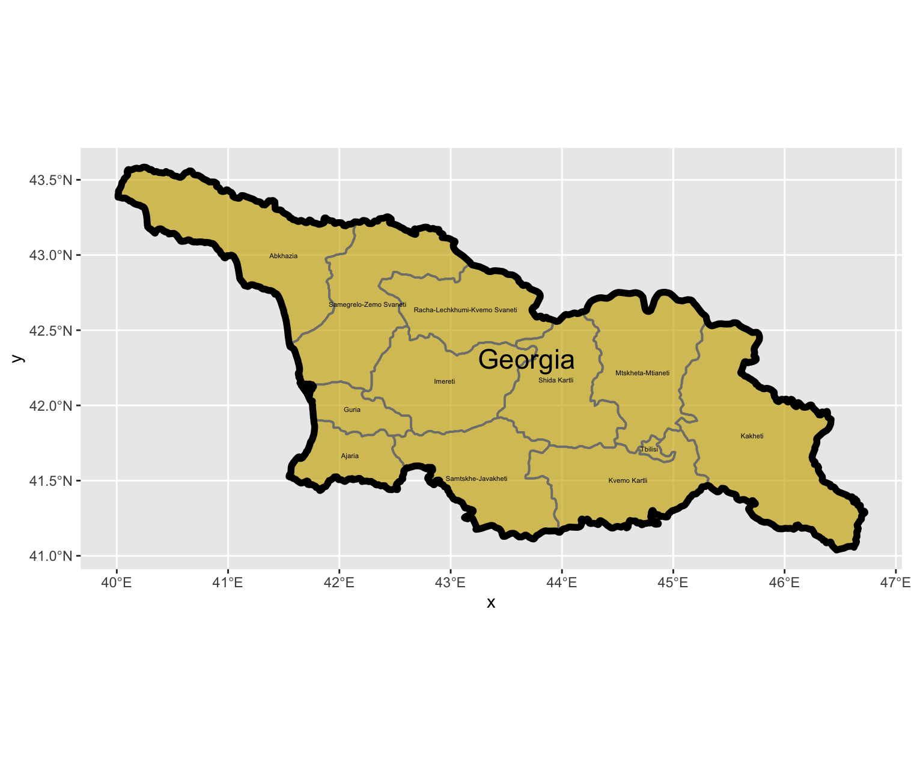
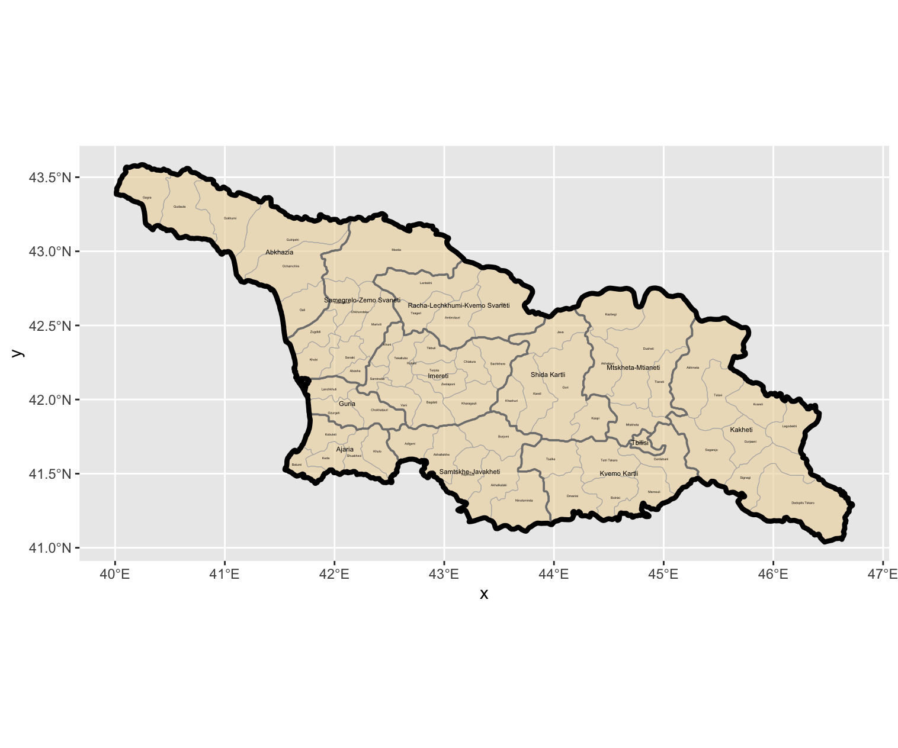
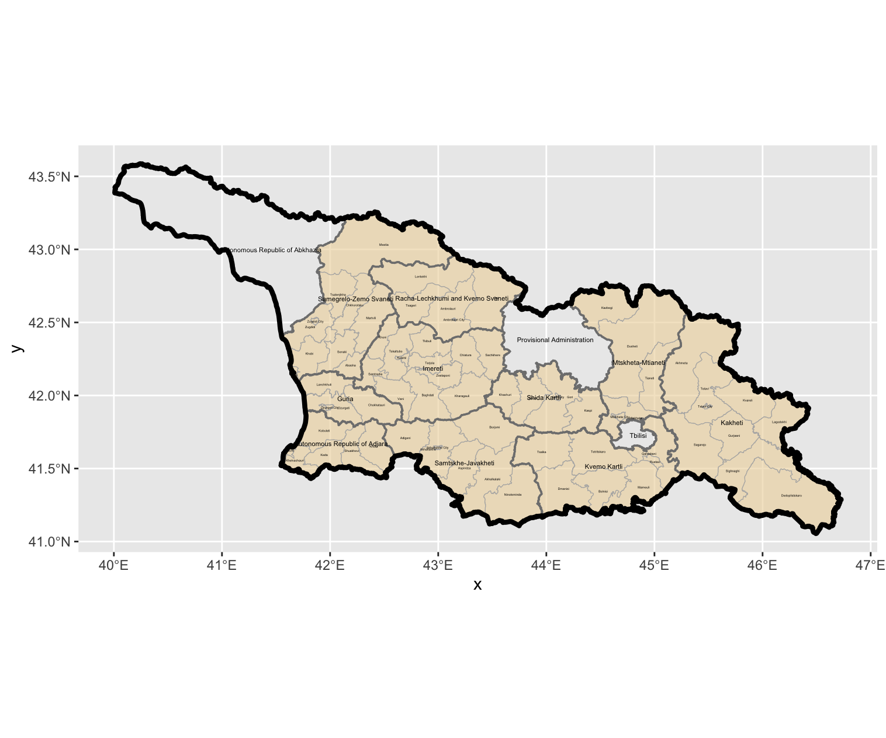
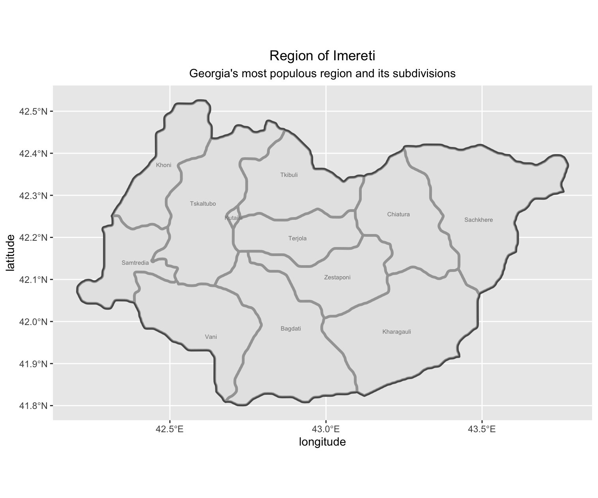
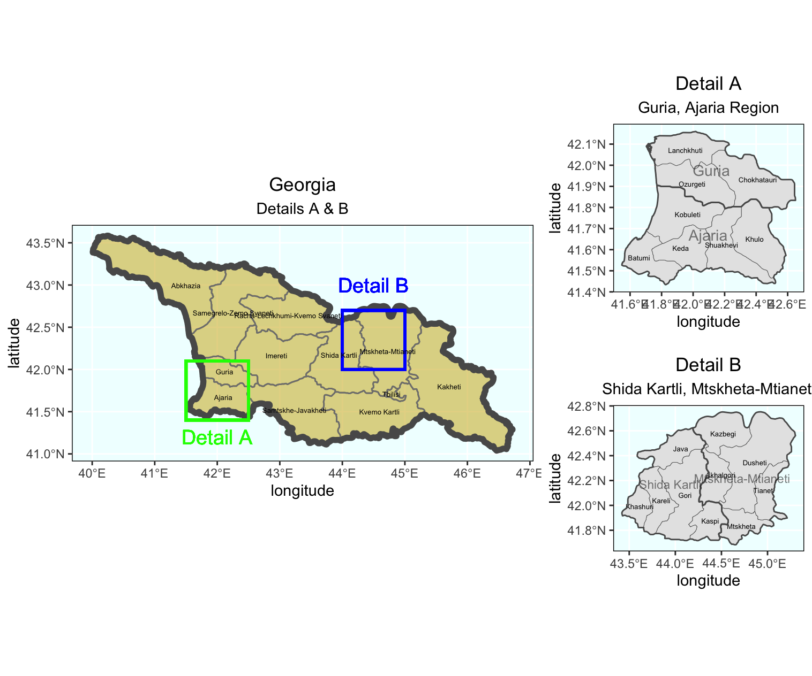

# Exercise 2 -- Spacial Population of Description of Georgia

## Plot Georgia's subdivisions
Data downloaded from GADM

```R
library(tidyverse)
library(sf)

rm(list=ls())

int <- read_sf('gadm36_GEO_shp/gadm36_GEO_0.shp')
adm1 <- read_sf('gadm36_GEO_shp/gadm36_GEO_1.shp')
adm2 <- read_sf('gadm36_GEO_shp/gadm36_GEO_2.shp')

ggplot() +
  geom_sf(data = adm1,
          size = 0.65,
          color = "gray50",
          fill = "gold3",
          alpha = 0.65) +
  geom_sf(data = int,
          size = 2.0,
          color = "black",
          #fill = "color",
          alpha = 0) +
  geom_sf_text(data = int,
               aes(label = NAME_0),
               size = 6,
               color = "black") +
  geom_sf_text(data = adm1,
                aes(label = NAME_1),
                size = 1.5,
                color = "black")

ggplot() +
  geom_sf(data = adm2,
          size = 0.2,
          color = "gray70",
          fill = "wheat2",
          alpha = 0.65) +
  geom_sf(data = adm1,
          size = 0.6,
          color = "gray50",
          alpha = 0) +
  geom_sf(data = int,
          size = 1.5,
          color = "black",
          alpha = 0) +
  geom_sf_text(data = adm1,
               aes(label = NAME_1),
               size = 1.5,
               color = "black") +
  geom_sf_text(data = adm2,
               aes(label = NAME_2),
               size = 0.7,
               color = "black")
```






### Stretch Goal 1
Select shapefiles from HDX instead of GADM

```R
int_alt <- read_sf('geo_adm_geostat_20191018_shp/geo_admbnda_adm0_geostat_20191018.shp')
adm1_alt <- read_sf('geo_adm_geostat_20191018_shp/geo_admbnda_adm1_geostat_20191018.shp')
adm2_alt <- read_sf('geo_adm_geostat_20191018_shp/geo_admbnda_adm2_geostat_20191018.shp')

ggplot() +
  geom_sf(data = adm2_alt,
          size = 0.2,
          color = "gray70",
          fill = "wheat2",
          alpha = 0.65) +
  geom_sf(data = adm1_alt,
          size = 0.6,
          color = "gray50",
          alpha = 0) +
  geom_sf(data = int_alt,
          size = 1.5,
          color = "black",
          alpha = 0) +
  geom_sf_text(data = adm1_alt,
               aes(label = ADM1_EN),
               size = 1.5,
               color = "black") +
  geom_sf_text(data = adm2_alt,
               aes(label = ADM2_EN),
               size = 0.7,
               color = "black")

```




### Stretch Goal 2
plot the geometries and labels for both the first and second level administrative subdivisions of Imereti, Georgia.

```R
ime_sf <- adm1 %>%
  filter(NAME_1 == "Imereti")

adm2 %>%
  filter(NAME_1 == "Imereti") %>%
  ggplot() +
  geom_sf(size = 1.2) +
  geom_sf_text(aes(label = NAME_2),
               size = 2) +
  geom_sf(data = ime_sf,
          size = 0.4,
          alpha = 0.5) +
  geom_sf_text(data = ime_sf,
               aes(label = NAME_1),
               size = 6) +
  xlab("longitude") + ylab("latitude") +
  ggtitle("Region of Imereti", subtitle = "Georgia's most populous region and its subdivisions") +
  theme(plot.title = element_text(hjust = 0.5), 
        plot.subtitle = element_text(hjust = 0.5))

```




### Stretch Goal 3
Produce detailed maps of more densely populated areas

```R
plot1 <- ggplot() +
  geom_sf(data = adm1,
          size = 0.5,
          color = "gray50",
          fill = "gold3",
          alpha = 0.5) +
  geom_sf(data = int,
          size = 2.0,
          alpha = 0) +
  geom_rect(data = adm1, xmin = 41.5, xmax = 42.5, ymin = 41.4, ymax = 42.1, 
            fill = NA, colour = "green", size = 1) +
  geom_rect(data = adm1, xmin = 44.0, xmax = 45.0, ymin = 42, ymax = 42.7, 
            fill = NA, colour = "blue", size = 1) +
  geom_sf_text(data = adm1,
               aes(label = NAME_1),
               size = 1.75) +
  geom_sf_text(data = adm1, x = 42, y = 41.2,
               aes(label = "Detail A"),
               size = 5,
               color = "green") +
  geom_sf_text(data = adm1, x = 44.5, y = 43,
               aes(label = "Detail B"),
               size = 5,
               color = "blue") +
  xlab("longitude") + ylab("latitude") +
  ggtitle("Georgia", subtitle = "Details A & B") +
  theme(plot.title = element_text(hjust = 0.5), plot.subtitle = element_text(hjust = 0.5),
        panel.background = element_rect(fill = "azure"),
        panel.border = element_rect(fill = NA))

### Create Detail A Map
west <- adm1 %>%
  filter(NAME_1 == "Guria" | NAME_1 == "Ajaria")

plot2 <- adm2 %>%
  filter(NAME_1 == "Guria" | NAME_1 == "Ajaria") %>%
  ggplot() +
  geom_sf(size = .15) +
  geom_sf_text(aes(label = NAME_2),
               size = 1.75) +
  geom_sf(data = west,
          size = .5,
          alpha = 0) +
  geom_sf_text(data = west,
               aes(label = NAME_1),
               size = 3.75,
               alpha = .5) +
  xlab("longitude") + ylab("latitude") +
  ggtitle("Detail A", subtitle = "Guria, Ajaria Region") +
  theme(plot.title = element_text(hjust = 0.5), plot.subtitle = element_text(hjust = 0.5),
        panel.background = element_rect(fill = "azure"),
        panel.border = element_rect(fill = NA))


### Create Detail B Map

east <- adm1 %>%
  filter(NAME_1 == "Shida Kartli" | NAME_1 == "Mtskheta-Mtianeti")

plot3 <- adm2 %>%
  filter(NAME_1 == "Shida Kartli" | NAME_1 == "Mtskheta-Mtianeti") %>%
  ggplot() +
  geom_sf(size = .15) +
  geom_sf_text(aes(label = NAME_2),
               size = 1.75) +
  geom_sf(data = east,
          size = .5,
          alpha = 0) +
  geom_sf_text(data = east,
               aes(label = NAME_1),
               size = 3,
               alpha = .5) +
  xlab("longitude") + ylab("latitude") +
  ggtitle("Detail B", subtitle = "Shida Kartli, Mtskheta-Mtianeti") +
  theme(plot.title = element_text(hjust = 0.5), plot.subtitle = element_text(hjust = 0.5),
        panel.background = element_rect(fill = "azure"),
        panel.border = element_rect(fill = NA))


ggplot() +
  coord_equal(xlim = c(0, 6.0), ylim = c(0, 4), expand = FALSE) +
  annotation_custom(ggplotGrob(plot1), xmin = 0.0, xmax = 4.0, ymin = 0, 
                    ymax = 4.0) +
  annotation_custom(ggplotGrob(plot3), xmin = 4.0, xmax = 6.0, ymin = 0, 
                    ymax = 2.0) +
  annotation_custom(ggplotGrob(plot2), xmin = 4.0, xmax = 6.0, ymin = 2.0, 
                    ymax = 4.0) +
  theme_void()

ggsave("details.png")

```



